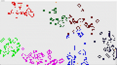

# Colonies game of life.

**Important**: Three Freshman Seminar class lovers from American University of
Armenia came together to work on a boring, unimportant programming project as
if it is just a side thing. You know what I mean right? Sarcasm ;)

**Colonies game of life** is an extension of the well-known simulation called Game of Life. **Colonies game of life** adds the concept of colonies into the game that "fight" with each other to win the game. Each colony in the simulation has its King, such that there is one special cell for King, and other (usual) cells are members (also called workers) of the colony. The King is responsible for generating workers (which come in different patterns well known in Game of Life that cause certain behaviors, ege patterns that are stable for protecting the King) to defend itself and potentially defeat the opponents' Kings. Similarly, workers are responsible for gathering resources for the King to be able to generate more workers. So the better patterns the colony chooses, the more workers, resources, and territory it would have and would be able to win the game. OK, one may get lost reading all this without a visual demo...



To get started clone the repository.

```
git clone https://github.com/tigranthegreat/colonies_game_of_life.git
```

Make sure that you have JVM installed since the project is written in java.

Run.

```
bash run.sh 120 60 6 gui
```

Param list: width, height, number of colonies, gui (if not specified will be console)
